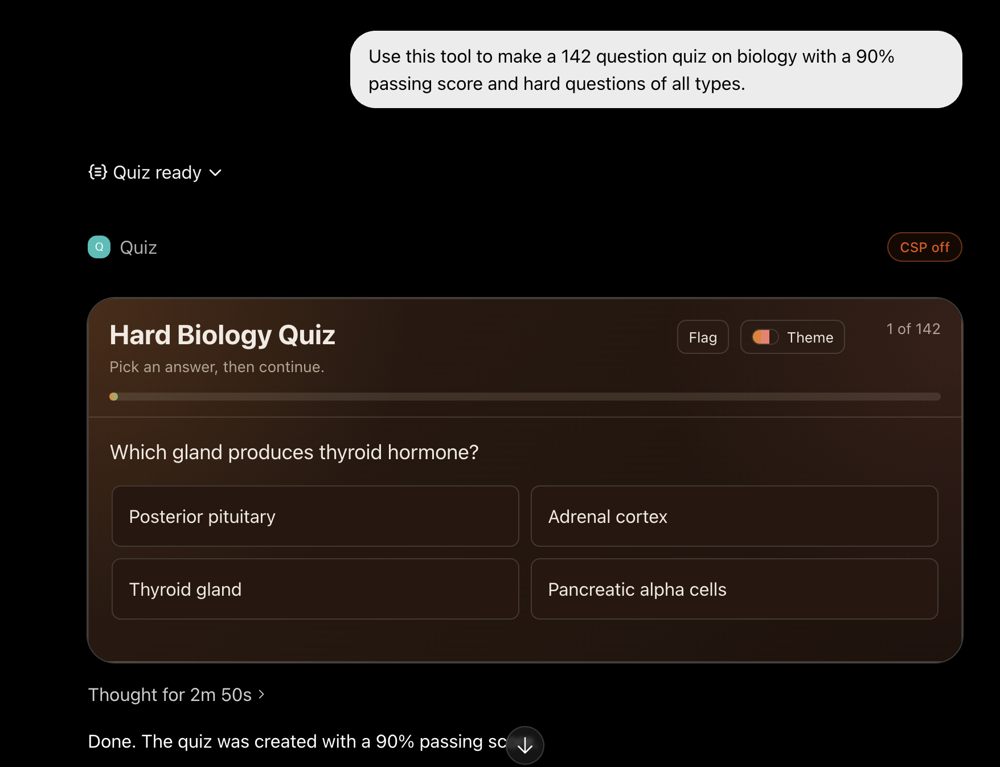
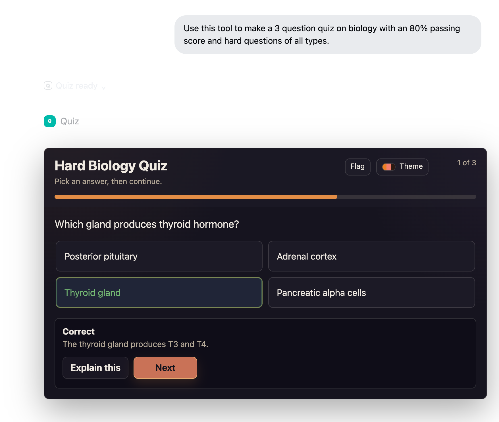
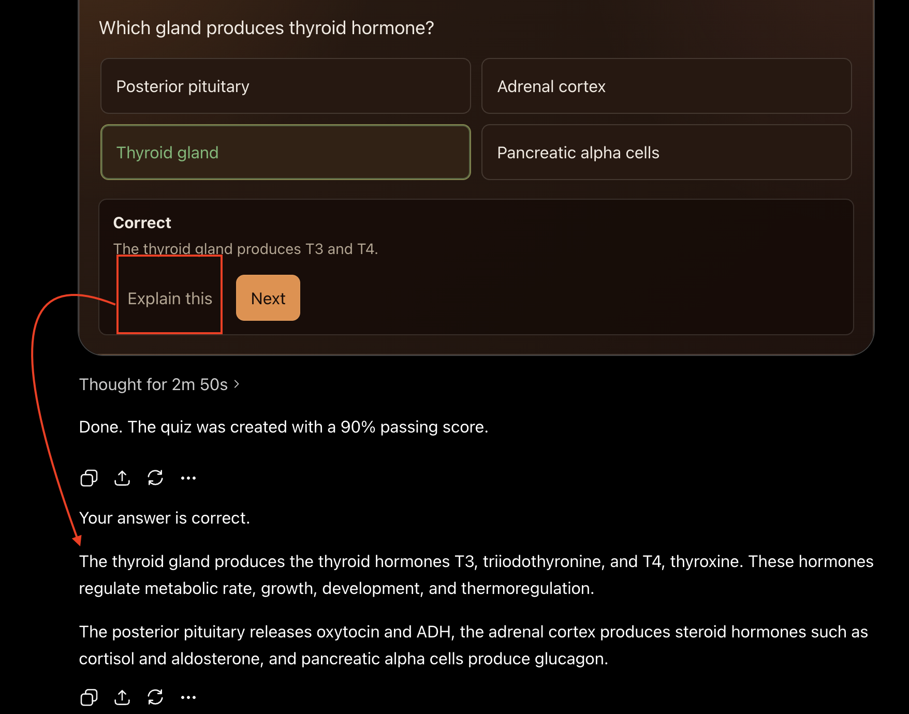

# Quiz MCP

Quiz MCP is a small ChatGPT App server that renders interactive quizzes inside ChatGPT.

It runs as a Cloudflare Worker. ChatGPT sends quiz questions to the Worker, the Worker checks and shuffles them, and the widget shows the quiz with scoring, explanations, review, study mode, retakes, and themes.

## Screenshots







## What You Get

- Interactive multiple-choice and true/false quizzes
- Single-answer and multiple-answer questions
- Immediate feedback after each answer
- Final score screen
- Review, missed-only review, flagged questions, and learn mode
- Built-in themes that persist in the browser when possible
- No database required
- No user progress stored on the server

## Best Auth Choice

For most people, use **No authentication**.

This app does not read private files, call paid APIs, store user data, or change anything outside the quiz widget. ChatGPT app setup is also much simpler with no auth.

No authentication means the deployed MCP endpoint is publicly reachable. Use it only for quizzes and content that are safe to expose publicly.

Use OAuth only if you are publishing a private app for a school, company, or closed group. OAuth requires a real identity provider.

Use the admin password mode only for your own testing. ChatGPT may not offer the header-based auth option needed for it.

## Quick Setup

### 1. Install Node.js

Install the current LTS version from:

```text
https://nodejs.org
```

After installing, open a new terminal.

### 2. Download This Project

Clone the repo or download it as a ZIP from GitHub.

Then open a terminal in the project folder.

### 3. Run The Guided Deploy

On macOS or Linux:

```bash
./deploy.sh
```

On Windows PowerShell:

```powershell
.\deploy.ps1
```

The script will:

- check for Node and npm
- install project dependencies
- install Wrangler
- help you log in to Cloudflare
- ask for an auth mode
- deploy the Worker
- print the MCP URL to use in ChatGPT

Choose `none` when it asks for auth mode unless you already know you need OAuth.

## Add It To ChatGPT

1. Open ChatGPT settings.
2. Go to **Apps & Connectors**.
3. Enable Developer Mode if needed.
4. Create a new app.
5. Choose **Server URL**.
6. Paste the MCP URL printed by the deploy script.

The URL should look like this:

```text
https://your-worker.your-account.workers.dev/mcp
```

For authentication, choose **No authentication** if you deployed with auth mode `none`.

After changing code or metadata, refresh the app in ChatGPT settings so ChatGPT reloads the latest tool description and widget template.

## Manual Setup

If you prefer commands:

```bash
npm install
npm test
npm run typecheck
npm run deploy
```

The deploy command uses Wrangler and minifies the Worker before upload.
The checked-in `wrangler.jsonc` is public/no-auth and intentionally leaves deployment-specific URLs blank. On production HTTPS, the Worker derives widget metadata from the incoming request origin. Keep personal workers.dev URLs in local notes or ignored deploy state, not in git.

## Local Development

Start a local Worker:

```bash
npm run dev
```

Run the smoke test in another terminal:

```bash
npm run smoke
```

The local smoke test checks:

- MCP initialize
- tool listing
- widget resource reading
- quiz rendering
- no-auth Apps SDK metadata
- the v5 widget template URI
- empty widget connect/resource domains
- the direct widget route CSP
- hidden OAuth metadata in no-auth mode

The root page (`/`) and demo preview page (`/preview`) are intentionally not served. This repo is meant to expose the MCP endpoint, not a public website.

The widget vendors KaTeX 0.17.0 into `src/vendor/katex.ts` with `npm run vendor:katex` and embeds it inline. No CDN or auto-updating math script is loaded at runtime.

## Tool Input

Tool name:

```text
render_inline_quiz
```

Example input:

```json
{
  "title": "Sample quiz",
  "targetGradePercent": 80,
  "theme": "aurora",
  "questions": [
    {
      "prompt": "Which number is prime?",
      "type": "multiple_choice",
      "explanation": "A prime number has exactly two positive factors.",
      "answers": [
        { "text": "2", "correct": true, "explanation": "2 is prime." },
        { "text": "4", "correct": false, "explanation": "4 is divisible by 2." }
      ]
    }
  ]
}
```

Compact input for long quizzes is also accepted:

```json
{
  "title": "Sample quiz",
  "questions": [
    {
      "q": "Which number is prime?",
      "type": "mc",
      "a": [
        { "t": "2", "c": true },
        { "t": "4" }
      ]
    }
  ]
}
```

Rules:

- A quiz can have 1 to 500 questions.
- Each question can have 2 to 6 answers.
- `multiple_choice` questions need at least one correct answer.
- `multiple_choice` questions may have more than one correct answer.
- `true_false` questions need exactly two answers and exactly one correct answer.
- For large quizzes, prefer compact aliases: `q`/`a` for question prompt/answers, `t`/`c`/`e` for answer text/correct/explanation, and `mc`/`tf` for type values.
- `correct` and `c` can be omitted for false answers.
- `targetGradePercent` is optional and defaults to 70.
- `theme` is optional. Available themes are `aurora`, `paper`, `sakura`, `ember`, `circuit`, and `harbor`.
- Question text, answer text, and explanations can include LaTeX math such as `$x = 2$`.
- Keep answer choices fair and non-signaling: similar length, detail, specificity, tone, grammar, and formatting; distractors should be plausible instead of obviously weaker than the correct answer.
- Do not depend on answer letters. The server shuffles answer order.

## Auth Modes

### none

Default and recommended.

```json
"AUTH_MODE": "none"
```

Use this for public quiz widgets and normal ChatGPT app setup.
Do not use this mode for private course material, internal exams, or anything that requires access control.

### oauth

Use this for private deployments with a real OAuth provider.

You must provide:

- issuer URL
- authorization server URL
- JWKS URL
- audience or resource
- scopes

The Worker validates bearer tokens before protected tool calls.

### admin_token

Use this only for private testing.

The guided deploy script generates a random password, saves it as a Cloudflare Worker secret, writes `.quizmcp-admin.json`, and makes unauthenticated routes return `404`.

Do not commit `.quizmcp-admin.json`. It is already ignored by git.

## Security Notes

- The Worker stores no quiz attempts, answers, or user progress.
- Widget progress is saved only in ChatGPT widget state.
- The answer key is sent only as widget metadata, not in model-visible quiz content.
- The widget uses `textContent` instead of `innerHTML` for quiz text.
- Requests, batch size, question count, string length, and total quiz text are limited.
- Control characters and bidirectional override characters are stripped from quiz text.
- The widget does not load external scripts, fonts, frames, or images.
- The widget's LaTeX renderer is vendored and pinned instead of loaded from a CDN.
- The app serves no public root HTML page.
- Secrets belong in Cloudflare secrets or local ignored files, never in git.
- Do not put `ADMIN_BEARER_TOKEN` or provider secrets in `wrangler.jsonc` `vars`.
- Do not commit personal workers.dev URLs. Leave `PUBLIC_BASE_URL` and `WIDGET_DOMAIN` blank unless you are committing a generic placeholder.
- The guided deploy preserves an existing private auth mode as the default choice, so pressing Enter will not silently switch an OAuth/admin deployment back to public no-auth.
- The guided deploy rejects unknown `AUTH_MODE` values instead of guessing.

## Useful Files

- `src/mcp.ts` - MCP server and HTTP routes
- `src/quiz.ts` - quiz validation and shuffling
- `src/widget.ts` - inline widget HTML, CSS, and JavaScript
- `scripts/deploy.mjs` - guided deploy script
- `scripts/smoke.mjs` - basic MCP smoke test
- `test/` - unit tests

## Commands

```bash
npm test
npm run typecheck
npm run deploy
npm run deploy:interactive
```

## License

MIT
